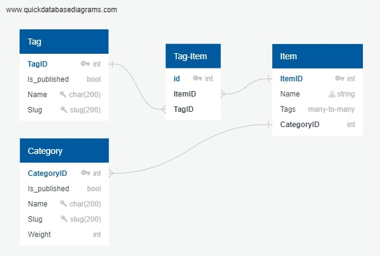

# Так выглядит ER диаграмма БД:
()
## 1.1 Создайте виртуальное окружение и активируйте введя в Linux-консоль:
```console
python3 -m venv venv

source venv/bin/activate
```
## 1.2 Или если вы на Windows:
```console
python -m venv venv

.\venv\Scripts\activate
```
## 2.1.1 При выходе в продакшн установите следующие зависимости:
```console
pip install -r requirements/prod.txt
```
## 2.1.2 На Windows:
```console
pip install -r requirements\prod.txt
```
## 2.2.1 ИЛИ при тестировании установите зависимости для теста введя в консоль:
```console
pip install -r requirements/test.txt
```
## 2.2.2 На Windows:
```console
pip install -r requirements\test.txt
```
## 2.3.1 ИЛИ зависимости для процесса разработки:
```console
pip install -r requirements/dev.txt
```
## 2.3.2 На Windows:
```console
pip install -r requirements\dev.txt
```
## 3 Подставьте переменные окружения в файл .env (заранее поставлены тестовые) следующей командой:
```console
cp .env.dist .env
```
## 4 Переместитесь в директорию проекта (директория с файлом manage.py) если вы не в ней:
```console
cd lyceum
```
## 5.1.1 Создайте миграции и примените их :
```console
python3 manage.py makemigrations
python3 manage.py migrate
```
## 5.1.2 На windows :
```console
python manage.py makemigrations
python manage.py migrate
```
## 5.2.1 Запустите тестовый сервер введя в консоль:
```console
python3 manage.py runserver
```
## 5.2.2 На windows:
```console
python manage.py runserver
```